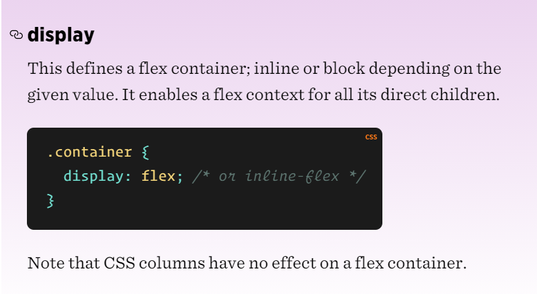
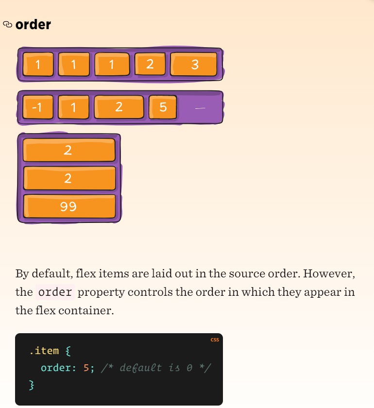

  &nbsp;&nbsp;&nbsp;&nbsp;&nbsp;&nbsp;&nbsp;&nbsp;&nbsp;&nbsp; **Welcome to Read: 03**

---
 

 **Flexbox and Templating** 

In this Read: 03, I will talk about those topics: 

- Javascript Templating Language and Engine— Mustache.js with Node and Express.
 
-  Flexbox. 

 

**Javascript Templating Language and Engine— Mustache.js with Node and Express** 

- Javascript Templating 

    - Javascript templating is a fast and efficient technique to render client-side view templates with Javascript by using a JSON data source. The template is HTML markup, with added templating tags that will either insert variables or run programming logic.   The template engine then replaces variables and instances declared in a template file with actual values at runtime, and convert the template into an HTML file sent to the client. 

- Mustache 

    - Mustache is a logic-less template syntax. It can be used for HTML, config files, source code — anything. It works by expanding tags in a template using values provided in a hash or object. 

    - mustache.js is an implementation of the mustache template system in JavaScript. It is often considered the base for JavaScript templating. And, since mustache supports various languages, we don’t need a separate templating system on the server side. 

- Mustache-Express 

    - If you intend you use mustache with Node and Express, you can use mustache-express. Mustache Express lets you use Mustache and Express together easily.  

---
 

**Flexbox** 

- Background 

    - The Flexbox Layout (Flexible Box) module aims at providing a more efficient way to lay out, align and distribute space among items in a container, even when their size is unknown and/or dynamic (thus the word “flex”). 

    - The main idea behind the flex layout is to give the container the ability to alter its items’ width/height (and order) to best fill the available space (mostly to accommodate to all kind of display devices and screen sizes). A flex container expands items to fill available free space or shrinks them to prevent overflow. 

- Basics and terminology 

    - If “regular” layout is based on both block and inline flow directions, the flex layout is based on “flex-flow directions”. Please have a look at this figure from the specification, explaining the main idea behind the flex layout. 

        

- Flexbox properties 

    - Properties for the Parent (flex container) 

          

        > For further infromation please click [here](https://css-tricks.com/snippets/css/a-guide-to-flexbox/#browser-devtools).

    - Properties for the Children (flex items) 

          

        > For further infromation please click [here](https://css-tricks.com/snippets/css/a-guide-to-flexbox/#browser-devtools).

---

 

 

|  **Read**  |   **Title**   |    **ToGo**   |
| ----------- | ----------- | ----------- |
|  Read: 01       |  SMACSS and Responsive Web Design        ||
|  Read: 02       |  jQuery, Events, and The DOM        ||
|  Read: 03       |  Flexbox and Templating        ||
|  Read: 04       |  Responsive Web Design and Regular Expressions        ||
|  Read: 05       |  Heroku Deployment        ||
|  Read: 06       |  Node, Express, and APIs        ||
|  Read: 07       |  APIs continued        ||
|  Read: 08       |  SQL        ||
|  Read: 09       |  Refactoring        ||
|  Read: 10       |  The Call Stack and Debugging        ||
|  Read: 11       |  EJS        ||
|  Read: 12       |  Components        ||
|  Read: 13       |  Update/Delete        ||
|  Read: 14a       |  DB Normalization        ||
|  Read: 14b       |  Project Ideas & APIs        ||
|  Read: 15       |  Diversity and Inclusion        ||

