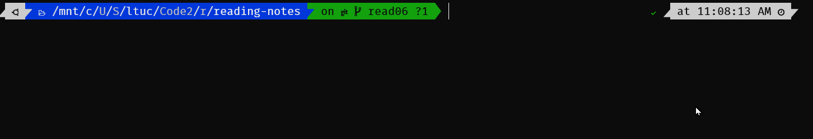
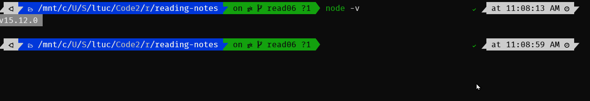

  &nbsp;&nbsp;&nbsp;&nbsp;&nbsp;&nbsp;&nbsp;&nbsp;&nbsp;&nbsp; **Welcome to Read: 06**

---
 

 **NODE.JS** 

In this Read: 06, I will talk about this topic: 

- NODE.JS.
 

---
 

**NODE.JS**  
What Is Node.js? 
Node.js® is a JavaScript runtime built on Chrome’s V8 JavaScript engine. 
Another definition of **Node.js** is an event-based, non-blocking, asynchronous I/O runtime that uses Google’s V8 JavaScript engine and libuv library. 
 

- The V8 engine 

    - Is the open-source JavaScript engine that runs in Google Chrome and other Chromium-based web browsers, including Brave, Opera, and Vivaldi. It was designed with performance in mind and is responsible for compiling JavaScript directly to native machine code that your computer can execute. 

- Install Node.js! Node Binaries vs Version Manager 

    - Node binaries 
        - Go to  to the official Node download page and grab the Node binaries for your system.  

    - Version manager 
        - This is a program that allows you to install multiple versions of Node and switch between them at will. 

- Is Node.js a live !!! 
    - You can check that Node is installed on your system by opening a terminal and typing `node -v` 
        

- npm !! 
    - **npm** is the JavaScript Package Manager, in addition to being the package manager for JavaScript, npm is also the world’s largest software registry. There are over 1,000,000 packages of JavaScript code available to download, with billions of downloads per week. Let’s take a quick look at how we would use npm to install a package. And to check the npm, type `npm -v` 
        

- What Is Node.js Used For? 
    - And if you want to start developing apps with any modern JavaScript framework (for example, React or Angular), you’ll be expected to have a working knowledge of Node and npm. This isn’t because you need a Node back end to run these frameworks. You don’t. Rather, it’s because these frameworks (and many, many related packages) are all available via npm and rely on Node to create a sensible development environment in which they can run. 

- What Kind of Apps Is Node.js Suited To? 
    - Node is particularly suited to building applications that require some form of real-time interaction or collaboration — for example, chat sites, or apps such as CodeShare, where you can watch a document being edited live by someone else. It’s also a good fit for building APIs where you’re handling lots of requests that are I/O driven (such as those needing to perform operations on a database), or for sites involving data streaming, as Node makes it possible to process files while they’re still being uploaded. 

- What Are the Advantages of Node.js? 
    - Aside from speed and scalability, an often-touted advantage of using JavaScript on a web server — as well as in the browser — is that your brain no longer needs to switch modes. You can do everything in the same language, which, as a developer, makes you more productive (and hopefully, happier). For example, you can easily share code between the server and the client.  

> For further infromation please click [here](https://www.sitepoint.com/an-introduction-to-node-js/).

 

 

---
 

 

|  **Read**  |   **Title**   |    **ToGo**   |
| ----------- | ----------- | ----------- |
|  Read: 01       |  SMACSS and Responsive Web Design        ||
|  Read: 02       |  jQuery, Events, and The DOM        ||
|  Read: 03       |  Flexbox and Templating        ||
|  Read: 04       |  Responsive Web Design and Regular Expressions        ||
|  Read: 05       |  Heroku Deployment        ||
|  Read: 06       |  Node, Express, and APIs        ||
|  Read: 07       |  APIs continued        ||
|  Read: 08       |  SQL        ||
|  Read: 09       |  Refactoring        ||
|  Read: 10       |  The Call Stack and Debugging        ||
|  Read: 11       |  EJS        ||
|  Read: 12       |  Components        ||
|  Read: 13       |  Update/Delete        ||
|  Read: 14a       |  DB Normalization        ||
|  Read: 15       |  Diversity and Inclusion        ||

